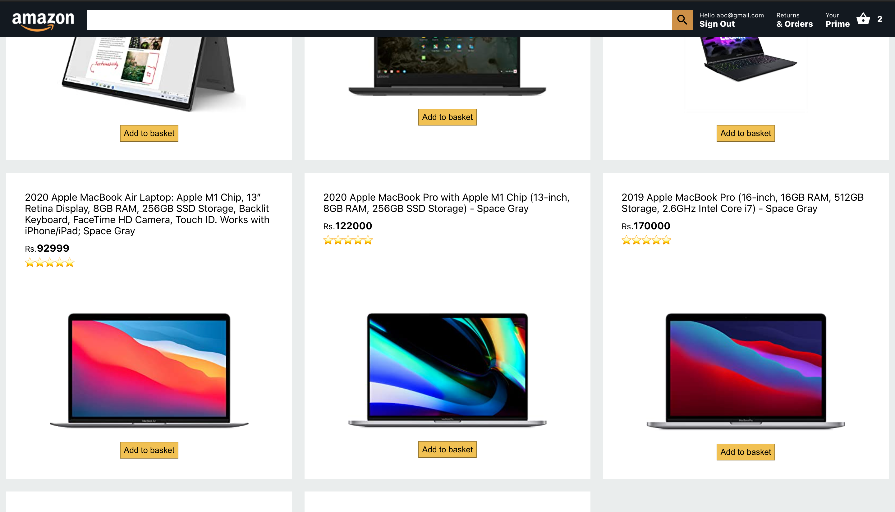
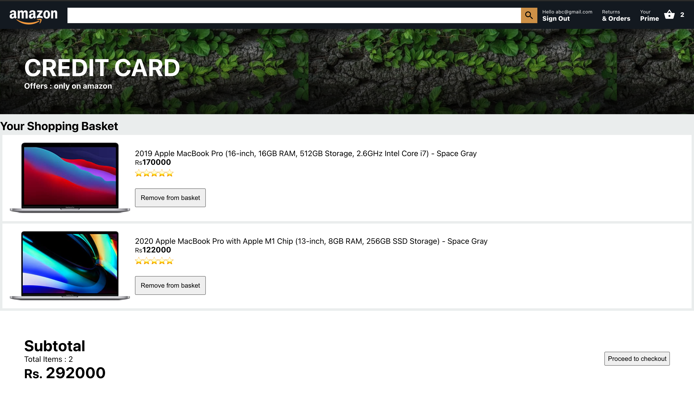

# Amazon clone (React,Firebase and Redux)

<h1 align="center">Built With</h1>
<p align="center">
  <a href="https://firebase.google.com/" target="_blank"></a> 
  <a href="https://reactjs.org/" target="_blank">  </a> 
  <a href="https://redux.js.org" target="_blank">  </a> 
</p>

## Requirements
First clone your project and run the command in your command product
###### remember to navigate to the project folder in order to avoid the errors
```sh
npm install
```
## How to Proceed
* To Clone the repo run the command given below:
```sh 
git clone https://github.com/Arun89-crypto/AMAZON_CLONE_FIREBASE_REACTJS.git
```
* Create a project in Firebase Console [Firebase](https://firebase.google.com/)
* Get your own API key from the firebase console
* Add the API key in <code>firebase.js</code> file
```sh 
apiKey: "Your_API_key"
```

## Screenshots of Project





